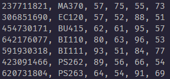

<div align="center">
  
# _GradeHub_

### A fast system that combines, calculates and formats data with ease
  
 </div>


## Description
> This program utilizes objects and manipulates the abstraction, encapsulation, inheritance and polymorphism principles of object-oriented programming in order to rapidly read from two input files which then combines and calculates the data to writes to an output file <br/>


## Usage

### CLI

A simplified `Makefile` allows for easy compilation of the program. <br/>
Automatically calling from predefined data files in `./data` allows for the user to easily input sample data, delimitted by a comma.

<br/>

> Enter source directory
```sh
$ cd src
```

> Compile all files
```sh
$ make all
```
> Run the program
```sh
$ make run
```

### File Handler

```cpp
#include "file_handler.hpp"

FileHandler::FileHandler(string u_filename) {
     filename = u_filename; 
     return;
}

void FileHandler::readlines() {
     fstream file; 
     file.open(filename, ios::in);

     if (file.is_open()) {
          string line;
          while (getline(file, line)) {
               lines.push_back(line);
          }
     }

     file.close();

     return;
}

void FileHandler::print() {
     for (int i = 0; i < lines.size(); i++) {
          cout<<lines[i]<<endl;
     }

     return;
}

void FileHandler::set_lines(vector<string>u_lines) {
     lines = u_lines;
     return;
}
```

## Sample Input Data



## Sample Output Data

